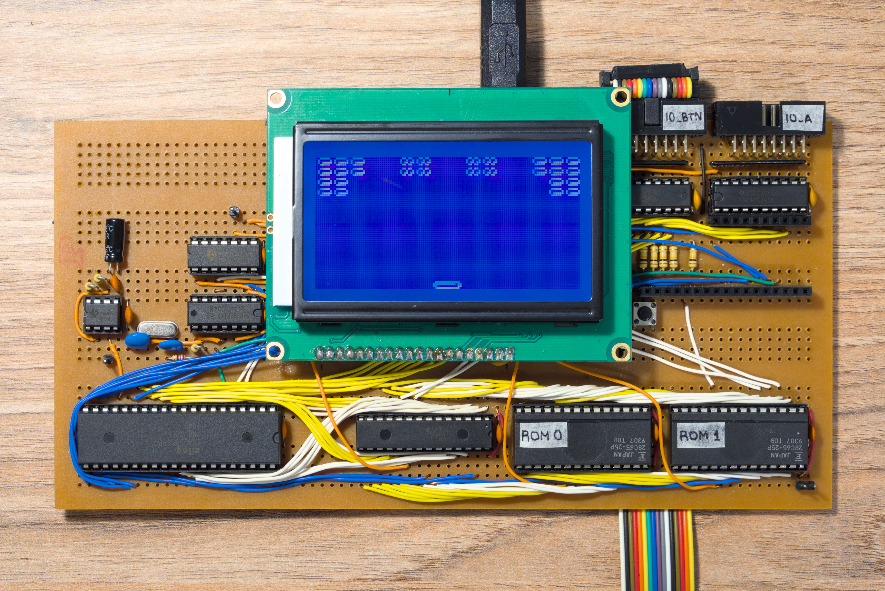
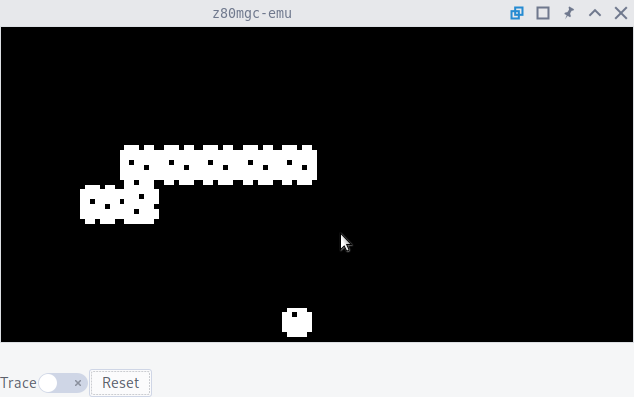

z80mgc
======

A minimal game console based on the z80 CPU. Something like a console from the 70s/80s such as the
original PAC-MAN arcade, but without video/sound chips which are hard to find.

This repo contains:

- Schematics
- Assembly code with games
- An emulator written in Rust and GTK
- EEPROM programmer based on
  [Ben Eater's arduino EEPROM programmer](https://github.com/beneater/eeprom-programmer)

Board:

Emulator:

Specs:

- CPU: Z80 CMOS at 6MHz MHz
- ROM: 16384 bytes (2 x 28C65 EEPROM)
- RAM: 32768 bytes (1 x 71256 RAM)
- Screen: 128x64 px LCD for text and graphics (ST7920 driver)
- Input: 8 buttons, read by polling
- Also:
  - Port with 8 I/O pins
  - Extension port with most z80 pins available
  - 555 timer at 1/126 seconds

Working games:

- Snake

Possible future games:

- Brick breaker
- Frogger
- Tanks

Timing
------

- Tick: Approx 1/126 of a second, timer counters are incremented each tick thanks to a 555 timer at
  around 126Hz that does NMI regularly.
- Frame: Depends in the game, for example the snake might move every every frame that happens every
  16 ticks.

Maximum clock speed
-------------------

- CPU is Z84C0006TPG. Maximum is 6.17MHz, equivalent to 166ns per clock. It waits memory for 2
  clock cycles (this time is shortened a bit because of the logic gates I use to select memory).
- Logic gates have around 10ns propagation time.

I can use RAM/ROM at full speed without caring about read times:

- RAM is 71256 SA25TPG. Has 25ns access time: data is valid 25ns after OE and CS are set.
- ROM is 28C64 25P. I think it has is 250ns access time: data is valid 250ns after OE and CS are set.

I can read the LCD without caring about read times. But LCD instructions are slow, I always have to
poll if it is ready before using it:

- LCD takes 1.6ms for clearing and 72 µs (72000ns) for each of the other instructions. When writing
  make the E pulse at least 160ns long (CPU does this for around 2 clock cycles) and leave the data
  for 20ns after disabling (CPU does this for around half a clock cycle). When reading, data is
  valid 260ns after enabled (CPU waits for around 2 clock cycles)

Speed:

- The snake game was doing around 150 instructions per game loop. If I consider 4 clocks per
  instruction, I think I can already run it at 60fps if the CPU clock is at 36kHz instead of 6MHz.
- If I run CPU at 5MHz, with 15fps, assuming instructions of 20 clocks, I can do around 16000 CPU
  instructions/frame.
- But the LCD is slower, it takes around 74µs per LCD instruction so if I run at 15fps, I can do
  around 900 LCD instructions per frame. Considering sprites of 8 tiles and that I have to give X
  and Y coordinates, it takes 24 instructions per sprite max I can draw a max of around 37 sprites
  per frame.

Game timimg
-----------

I don't have a timer chip like the z80 CTC. So I can count in software the amount of NMI, comes from
a 555 timer.
The interrupt happens at falling edge so there is no problem on leaving the NMI pin low for a long
time.

The counter will be 8 bit. The value 255 could be equivalent to approx 2s so in that case I should
call NMI at approx 128Hz. I do this with a 555 which apparently can reach until 100kHz.

Dropped ideas
-------------

- Leave a clock input so I can drive it slowly clock by clock
- Print a PCB, but it is so expensive to do a double layer. Doing a single layer PCB in KiCad is too
  hard because of crossings.
- Headers to Data, Address and EEPROMs pins so I can write EEPROMs without taking them out
- Other timer options:
  - Z80 CTC
  - I could use binary counters. If I have a clock of 6MHz, after 16 bits of counters I would have
    91.55Hz. I also could give the 8 most significative digits in an input port.
- Other display options I considered:
    - LCD with HD44780: http://6502.org/mini-projects/optrexlcd/lcd.htm
    - LCD with ST7920, allows graphics
    - LCD with KS0108, allows graphics
    - Nokia 5110
    - ILI9163C display
    - Something with AD722
    - Yamaha V9958, Yamaha V9938, Yamaha V9959, Yamaha V9990, Motorola 6845, Motorola 6847, TMS9918
    - Text only OSD chips: MAX7456
    - Text only: Intel 8275 CRTC together with Intel 8257 DMA controller
    - Composite video:
      http://www.cpuville.com/Projects/Standalone-Z80-computer/Standalone-Z80-home.html
    - Composite video with a microcontroller
    - Composite video with ICs: https://www.chrismcovell.com/dottorikun.html#schematic
    - Composive video with EEPROMs?
- I considered adding sound with SN76489
- A buzzer can be done in an expansion board:
    - An 74HC245 that receives 8 bits of data as input
    - The outputs of the 74HC245 go directly to a R-2R resistor ladder to implement a DAC (Digital
      Analog Converter)
    - The output of the DAC goes to a 555 VCO (Voltage Controlled Oscillator). Maybe the bit 7 of
      the 74HC245 should enable and disable the 555
    - The output of the 555 goes directly to a buzzer
    - In software, I should write a certain number to the I/O port and the buzzer should sound until
      I write zero
    - Add LEDs to bus, MREQ, IOREQ, WR, RD, etc. But then I realized that if the CPU works at 6MHz
      and I wont even see them blink.

Bricks game
-----------

### With framebuffer:

Game start:

- Bricks: Draw all bricks

Game loop, in order:

- Ball: Clear old position of ball and move ball coordinate

- Bricks: If collision with ball, redraw if modified or draw zeros to clean area.

- Powerups: If collision with pad, draw zeros to clean area and give powerup.

- Powerups: Draw the 8x3 graphic with OR. Should draw even if not descending because if the ball
  comes and it is stationary then there will be conflicts, but very unlikely and avoidable if both
  ball and powerup move together

- Pad: Draw with OR with shifting/rotation.

- Ball: Draw with OR with shifting/rotation.

### Powerups

- Bigger pad

- Smaller pad

- Faster ball

- Slower ball

- Extra ball

- Move all bricks downwards

- Extra life

### Old ideas

Will have a DUL (Drawing Update List) containing coordinates and the byte of graphics that will be
drawn. Some kind of compressed framebuffer. This is used so I can overlap graphics with AND
operations in RAM before writing to the LCD.

Game start:

- Bricks: Draw all bricks

Drawing/updating, in order:

- Bricks: If collision with ball, redraw if modified or draw zeros to clean area.

- Powerups: If collision with pad, draw zeros to clean area and give powerup.

- Powerups: Draw in the DUL the 8x4 graphic. The graphic is actually 8x3 but the top line is empty
  so it will erase the old frame. Draw even if not descending because if the ball comes and it is
  stationary then there will be conflicts

- Pad: Draw in the DUL using shifting/rotation.

- Ball: Draw in the DUL using shifting/rotation.

Old ideas:

- Powerups: Collision detection with ball and pad, redraw to clean area in that case. If moving
  downward in this frame, draw full 8x4 object. The graphic is actually 8x3 but the top line is
  empty so it will erase the previous. Will be destroyed as soon as it touches the
  ball or the pad, so no problems in drawing order.

- Pad: Draw using shifting/rotation. Draw each time it moves. Draw it in a framebuffer that only
  covers the last

- Ball: Draw using shifting/rotation. Draw each time it moves, do it last

PCB design notes
----------------

- Ground plane in the back layer?

- Check datasheet for recommendations of decoupling capacitors

- Check "return paths" for high speed signals

- Route more important signals first so I minimize the length, vias, etc.

- Add test points, with ground clips

- Add mounting holes in corners first

- I can add jumper resistors

- I can make the SRAM with wide holes too

- Vertial traces in one side and horizontal traces on the other, that way the ground plane is mostly
  intact

- No 90deg angles, https://www.alternatezone.com/electronics/files/PCBDesignTutorialRevA.pdf

- "I rarely go smaller than 10 mil for any trace unless I have to, and for power I try to use at least 30 mil"
As a start, you may like to use say 25 thou for signal tracks, 50 thou for power and ground tracks, and 10-15
thou for going between IC and component pads

- Pads 2x the diameter og the hole. There are some common practices used when it comes to generic component pads. Pads for leaded
components like resistors, capacitors and diodes should be round, with around 70 thou diameter being common.
Dual In Line (DIL) components like IC’s are better suited with oval shaped pads (60 thou high by 90-100 thou
wide is common). Pin 1 of the chip sould always be a different pad shape, usually rectangular, and with the
same dimensions as the other pins.p

- At least 15 thou is a good clearance limit for basic through hole designs

- Ensure that no part of the silkscreen overlaps a bare pad.

- As a general rule, you should use at least one bypass capacitor per IC or other switching component if possible.
Common values of bypass capacitors are 100nF for general purpose use, 10nF or 1nF for higher frequencies,
and 1uF or 10uF for low frequencies.

- Put name and description in silkscreen

- Check that solder points have thermal relief pads
